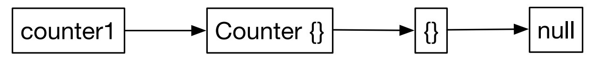

# 继承

与其他主流的编程语言不同，JS并不是基于类的概念来实现继承的，它是通过内部的原型链来实现继承的效果，这会让很多其他语言的开发者感到困惑，例如Java等。此外这样的继承机制也容易带来维护上的困难和概念上的混淆。

幸好，ES6的出现为我们带来了耳目一新的感觉，让一切变得自然和易于理解。但要注意，**新的语法并没有改变内部的继承机制**，换而言之，它只是一个语法糖而已。

## 理解原型继承

原型继承的实现使用了委托\(delegation\)。JS遵循着**委托优于继承**的理念，基于原型的语言使用对象链来委托请求调，依赖于原型链上的下一个对象作为它的基\(base\)。而基于类的继承就灵活很多，只会继承到父类\(parent\)，不会继续向前追溯。此外，原型继承是动态的；你可以在运行时修改作为基的对象，这个基对象被称为对象的原型。

### 原型链

由于继承的执行使用的是对象链，而非类层级结构，为了理解原型继承，我们首先需要了解对象链的行为。举个例子：

```javascript
class Counter {}

const counter1 = new Counter();
const counter2 = new Counter();

const counter1Prototype = Reflect.getPrototypeOf(counter1);
const counter2Prototype = Reflect.getPrototypeOf(counter2);

console.log(counter1 === counter2); //false
console.log(counter1Prototype === counter2Prototype); //true
```

类的实例互不相同，但是却共享同一个原型对象。

JS构建了一个原型链。以之前代码为例，结果为：



### Get vs. Set 行为对比

继承的目的是复用方法和属性。当从一个对象中获取一个属性或者方法时，这个对象可以通过委托请求其原型对象的方式复用原型上的成员。然而获取和修改一个属性的行为却存在着巨大的差异。

```javascript
class Counter {}

Counter.prototype.count = 0;
Counter.prototype.increment = function() { this.count += 1; };

const counter1 = new Counter();
const counter2 = new Counter();

console.log(counter1.count);
console.log(counter2.count);

counter1.increment();

console.log(counter1.count);
console.log(counter2.count);
```

输出：

```text
0
0
1
0
```

前两个输出很好理解，`counter1`和`counter2`共享一个原型对象，但后两个输出为什么不都是是1呢？说好的共享原型对象呢？

单从结果来看，`Counter`的实例共享原型对象，但是改变一个对象却不会影响另一个。这是什么原因呢？答案就在JS如何使用原型上：

**Gets深度查找，但是sets却总是浅的\(Gets search deep, but sets are always shallow\)**。

当我们尝试获取实例的成员时，如果实例有该成员，则立即返回，如果没有，则向前查询该实例的原型对象，这个过程将在原型链上不断执行，知道找到这个成员，或者到了原型链的末端。而当实例上执行`set`方法时，`set`只发生在该实例上。

在本例中，执行`increment()`后，实例`counter1`上拥有了属性`count`，此时`counter1`执行`counter1.count`时，直接返回实例对象的`count`值。测试代码如下：

```javascript
const counter1 = new Counter();

console.log(
    `Prototype has: ${Object.keys(Reflect.getPrototypeOf(counter1))}`);

console.log(`Before increment instance has: ${Object.keys(counter1)}`);
counter1.increment();
console.log(`After increment instance has: ${Object.keys(counter1)}`);
```

执行结果：

```text
Prototype has: count,increment
Before increment instance has:
After increment instance has: count
```

## 继承一个Class

ES6极大的简化了创建原型继承的过程，并且为重写方法提供了简洁而优雅的途径。

### 扩展一个Class

首先需要一个基类作为一个原型以及一个衍生类来复用这个原型：

```javascript
class Person {
    constructor(firstName, lastName) {
        console.log('initializing Person fields');
        this.firstName = firstName;
        this.lastName = lastName;
    }

    toString() {
        return `Name: ${this.firstName} ${this.lastName}`;
    }

    get fullName() { return `${this.firstName} ${this.lastName}`; }

    get surname() { return this.lastName; }
}
```

创建`ReputablePerson`类来继承`Person`类

```javascript
class ReputablePerson extends Person {
    constructor(firstName, lastName, rating) {
        console.log('creating a ReputablePerson');
        super(firstName, lastName);
        this.rating = rating;
    }
}
```

使用`extends`来继承一个类。在`constructor`中，`super()`需要在`this`出现之前被调用。`super()`将唤醒基类的构造方法，并且JS坚持实例中基类的部分的状态要在衍生部分的状态之前进行实例化。调换`ReputablePerson`构造方法中最后两行代码将会导致一个运行时错误。

### 重写方法

子类中重写父类的方法很简单，只需要在子类中定义与父类相同的方法名即可。

我们在`ReputablePerson`类中重写`toString()`方法和`firstName`属性：

```javascript
toString() {
    return `${super.toString()} Rating: ${this.rating}`;
}

get fullName() {
    return `Reputed ${this.surname}, ${super.fullName} `;
}
```

由于方法或属性可能在父类中已经实现，在子类或实例中我们需要小心的使用合适的语法来获取正确的结果。下面是一些我们需要遵循的规则：

* 如果要获取实例或子类中而非父类中的成员，使用`this` -- 记住`this`是动态作用域。
* 如果一个成员只在父类中存在，使用`this`。如果将来你在子类中覆盖了该成员，则优先使用子类中的成员。
* 如果想将子类的成员传递给父类，并能够从父类获取，使用`super()`。

在重写的`toString()`方法中，我们使用了`super`来调用父类的`toString()`方法。`fullName`的重写也与之类似。但是调用弗雷德`surname`时，却不必加入`super`前缀，因为在子类中没有该方法，因此不会隐藏父类的`surname`方法。

大多数情况下使用`this`是安全的，也是推荐的，除了下面的情况我们需要使用`super`前缀：

* 需要访问弗雷德成员，且在子类中有同样名称的成员
* 需要传递成员到父类，并在子类中访问

最后让我们测试一下重写的代码：

```javascript
const alan = new ReputablePerson('Alan', 'Turing', 5);
console.log(alan.toString());
console.log(alan.fullName);
```

结果为：

```text
creating a ReputablePerson
initializing Person fields
Name: Alan Turing Rating: 5
Reputed Turing, Alan Turing
```

### extends 隐含原型继承

尽管看起来ES6中的`extends`像是基于类的继承，但是事实上底层还是原来的原型链机制。我们用实际的例子来验证。

首先写一个函数，给定一个对象，打印该对象，然后打印其原型链：

```javascript
const printPrototypeHierarchy = function(instance) {
    if(instance !== null) {
        console.log(instance);
        printPrototypeHierarchy(Reflect.getPrototypeOf(instance));
    }
};
```

利用递归实现当前实例原型对象的打印，直到原型链结束。接下来通过`ReputablePerson`的实例来调用：

```javascript
const alan = new ReputablePerson('Alan', 'Turing', 5);

printPrototypeHierarchy(alan);
```

输出结果为：

```text
ReputablePerson { firstName: 'Alan', lastName: 'Turing', rating: 5 }
ReputablePerson {}
Person {}
{}
```

第一行为实例对象的详细信息，第二行为实例的原型，第三行为原型的原型，最后一行为最终的原型。

### 修改原型链

与基于类的继承不同，原型链并非是不变的，我们可以修改原型链。

```javascript
class ComputerWiz {}

Reflect.setPrototypeOf(Reflect.getPrototypeOf(alan), ComputerWiz.prototype);

console.log('...after change of prototype...');

printPrototypeHierarchy(alan);
```

不同于修改实例`alan`的原型，这里修改了实例`alan`原型的原型。输出如下：

```text
...after change of prototype...
ReputablePerson { firstName: 'Alan', lastName: 'Turing', rating: 5 }
ReputablePerson {}
ComputerWiz {}
{}
```

### 使用默认构造方法

当你使用类继承且未定义构造器时，JS会提供默认构造器，且在构造器中自动调用`super`方法，并传递所有参数到父类。

```javascript
class AwesomePerson extends Person {
    get fullName() {
        return `Awesome ${super.fullName}`;
    }
}

const ball = new AwesomePerson('Lucille', 'Ball');
console.log(ball.fullName);
```

输出：

```text
initializing Person fields
Awesome Lucille Ball
```

### 扩展遗存的类

为了更好的兼容性，ES5的语法创建的类一样可以实现类继承。举个例子：

```javascript
function LegacyClass(value) {
    this.value = value;
}

class NewClass extends LegacyClass {}

console.log(new NewClass(1));
```

## 使用species管理实例类型

设想一下，某个类有一个`clone()`方法，返回自身类型的实例，如果有一个继承于该类的子类，同样想使用该方法，那么应该返回父类的实例还是子类的实例呢？

可能你会说，需要视情况而定。没错，它可能取决于上下文，或是其他因素。但是在编程角度来说，我们需要有一个途径来管理这些被创建的实例类型。接下来我们看一下一些内置类是如何处理这个问题，然后思考如何用类似的方式管理自己的代码。

### 两个内置类及其不同的行为

来看一个例子：

```javascript
class MyString extends String {}
class MyArray extends Array {}

const concString = new MyString().concat(new MyString());
const concArray = new MyArray().concat(new MyArray());

console.log(`instanceof MyString?: ${concString instanceof MyString}`);
console.log(`instanceof MyArray?: ${concArray instanceof MyArray}`);
```

结果为：

```text
instanceof MyString?: false
instanceof MyArray?: true
```

答案出乎我们的预料，`String`类的`concat()`方法为返回的实例保留了自己的类型，而`Array`类则返回了子类的类型。那么如何实现类似`Array`类的效果呢？

接下来我们需要在父类中实现一个方法：

* 使返回实例类型和父类相同
* 使返回实例类型和子类相同
* 让子类决定类型应该是什么

#### 指向父类类型

```javascript
class Names {
    constructor(...names) {
        this.names = names;
    }

    filter1(selector) {
        return new Names(...this.names.filter(selector));
    }
}

class SpecializedNames extends Names {
}

const specializedNames = new SpecializedNames('Java', 'C#', 'JavaScript');
console.log(specializedNames.filter1(name => name.startsWith('Java')));
```

结果为：

```text
Names { names: [ 'Java', 'JavaScript' ] }
```

此时，`filter1`返回实例类型固定为`Names`类型。

#### 选择基于运行时类型

```javascript
filter2(selector) {
    const constructor = Reflect.getPrototypeOf(this).constructor;

    return new constructor(...this.names.filter(selector));
}
```

执行

```javascript
console.log(specializedNames.filter2(name => name.startsWith('Java')));
```

输出：

```text
SpecializedNames { names: [ 'Java', 'JavaScript' ] }
```

#### 配置返回类型

当我们获得一个构造器时，我们可以从中获得`static`方法和属性。我们将使用`static`属性`kindHint`来告诉我们返回的实例类型。

```javascript
filter3(selector) {
    const constructor =
        Reflect.getPrototypeOf(this).constructor.kindHint ||
            Reflect.getPrototypeOf(this).constructor;

    return new constructor(...this.names.filter(selector));
}
```

直接执行：

```javascript
console.log(specializedNames.filter3(name => name.startsWith('Java')));
```

输出：

```text
SpecializedNames { names: [ 'Java', 'JavaScript' ] }
```

接下来修改`SpecializedNames`类：

```javascript
class SpecializedNames extends Names {
    static get kindHint() {
        return Names;
    }
}
```

输出变为：

```text
Names { names: [ 'Java', 'JavaScript' ] }
```

功能上没什么问题，但是`kindHint`这个名称太过绝对，且不是独一无二的值，这时可以使用`Symbol`。

#### 使用species

我们可以自定义symbol，例如`Symbol.for("KINDHINT")`，但是JS中已经有了预定义的symbol -- `Symbol.species`。

`Symbol.species`用于传递构造器来创建衍生对象。使用它改造`SpecializedName`：

```javascript
class SpecializedNames extends Names {
    static get [Symbol.species]() {
        return Names;
    }
}
```

修改`filter3()`：

```javascript
filter3(selector) {
    const constructor =
        Reflect.getPrototypeOf(this).constructor[Symbol.species] ||
            Reflect.getPrototypeOf(this).constructor;

    return new constructor(...this.names.filter(selector));
}
```

此前`Array`类也使用了`Symbol.species`：

```javascript
class MyArray extends Array {
    static get [Symbol.species]() { return Array; }
}

const concArray = new MyArray().concat(new MyArray());
console.log(`instanceof MyArray?: ${concArray instanceof MyArray}`);
```

此时，结果变为：

```text
instanceof MyArray?: false
```

