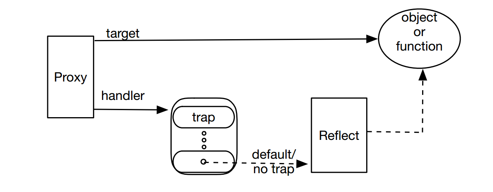
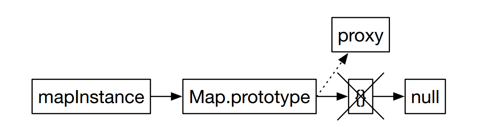

# 深入元编程

方法合成是元编程最为强大的一种形式。你可以基于运行时上下文和对象的状态，改变API以及对象的行为。你可以抛开原作者的意图，将已存在的类按照自己的需求进行修改。

方法合成直到最近才在JS中得到支持。在此之前你能做的仅仅只是方法注入。随着方法合成和两个新的类`Reflect`和`Proxy`的介绍，你可以在方法调用执行期间进行劫持，并且按照你希望的方式改变调用的命运。

由于拥有了运行时合成成员的能力，一个类的不同对象可能包含不同的方法和行为。尽管这是一个高度复杂的编程方式，它也为更改对象行为提供了现象级的弹性，同时让代码产生难以置信的扩展性。

`Reflect`类是查询和获取属性，方法，以及对象元数据的一个门户接口。无论何时你想获取对象元数据的一些详情，例如，获取对象的原型，`Reflect`可以帮助你实现这样的操作。

`Proxy`是元编程的忍者。它可以封装对象，并且像一个拦截器一样存在。你可以配置一个proxy，在运行时动态的将一个调用分发到被封装对象真实方法，或是分发到一个你选择的替代方法。用这样的方式，你可以有选择性的更改已知类的行为，而不会改变它们的源码。

尽管`Proxy`是一个合成你的自定义行为的途径，目前最好合成预定义行为的方案是装饰器(decorator)。换而言之，若要伪造自定义的动态方法，使用`Proxy`。若想注入第三方创建的方法，使用装饰器。尽管装饰器目前还未被JS原生支持，我们可以用转译工具来提前使用它。

## Reflect的目的

`Reflect`有两个主要的目的：

- 它是对象上进行的各种元操作的首要场所。例如`Reflect`提供方法来获取和设置对象的原型，并且检查对象上是否存在某个属性，等等。

- `Proxy`类默认将它的方法发送到`Reflect`。之后，当使用一个proxy时，我们只可以覆盖选中的操作，并且方便的将剩余部分留给默认实现。

`Reflect`中有两大类方法，我们选取其中一些感兴趣的，并且经常使用的部分进行学习。

### 通过Reflect激活函数

传统的JS有三种方式激活函数：`()`，`call()`，或者`apply()`。假设有一个函数`greet`：

```js
const greet = function(msg, name) {
    const pleasantry = typeof(this) === 'string' ? this : 'have a nice day';
    console.log(`${msg} ${name}, ${pleasantry}`);
};
```

我们可以通过如下几种方式激活：

- `greet('Howdy','Jane');`

- `greet.call('how are you?', 'Howdy', 'Jane');`

- `greet.apply('how are you?', ['Howdy', 'Jane']);`

尽管上述方法在现代JS中依然有效，但如果想传入一个context对象，Reflect的`apply()`函数现在是一个比`call()`和`apply()`更好的选择。重写如下：

```js
Reflect.apply(greet, 'how are you?', ['Howdy', 'Jane']);
```

尽管开始看起来有些臃肿，但是Reflect的`apply()`函数在改变方法调用的行为时非常有效。

### 获取原型

JS现在有了更加优雅的方式来获取和改变对象的原型，下面来看一下如何通过`Reflect`的方法来实现：

```js
const today = new Date();
console.log(Reflect.getPrototypeOf(today));

const myPrototype = {};
Reflect.setPrototypeOf(today, myPrototype);

console.log(Reflect.getPrototypeOf(today));
```

我们通过`getPrototypeOf()`获取了对象的原型，又通过`setPrototypeOf()`重新修改了对象的原型，结果如下：

```
Date {}
{}
```

改变对象的原型是有很大风险的，它将改变实例的继承结构，所以使用它需要权衡和小心。

### 获取和设置属性

回想一下之前的例子，使用`[]`来获取实例。下面是一个`Person`类:

```js
class Person {
    constructor(age) {
        this.age = age;
    }

    play() { console.log(`The ${this.age} year old is playing`); }

    get years() { return this.age; }
}
```

要获取实例`sam`的`age`属性，可以直接`sam.age`。然而如果在写代码时还不知道具体的属性名称，我们可以将属性名称以字符串的形式传给Reflect的`get()`方法。要想设置一个属性值，则可以使用`set()`方法。

```js
const sam = new Person(2);

const propertyName = 'age';

Reflect.set(sam, propertyName, 3);
console.log(Reflect.get(sam, propertyName));
```

这里可能看起来并没有比直接使用`[]`带来更佳的效果，反而看起来更加的繁琐。确实如此，但是当我们稍后在`Proxy`的上下文中使用该方法时，一切将会变得有意义。

此前我们通过`Reflect.apply()`方法激活一个独立函数。我们同样可以它来调用一个类中的方法。接下来让我们用之调用`play()`方法：

```js
Reflect.apply(sam.play, sam, []);
Reflect.apply(Person.prototype.play, sam, []);
```

第一个参数用于获取`play()`方法的引用，可以使用实例或是类的原型作为引用。第二个参数是在确定在哪个实例上激活该方法，也就是上下文`this`对象。最后一个参数是参数数组。最后结果为：

```
The 3 year old is playing
The 3 year old is playing
```

### 通过Reflect探索属性

`Reflect`拥有方法；来遍历对象的所有key，并且检查属性是否存在。举个例子：

```js
console.log(Reflect.ownKeys(sam));
console.log(Reflect.has(sam, 'age'));
```

其中`ownKeys()`方法返回所有key的名称数组，包括属性，字段以及方法。`has()`方法返回是否存在某属性的判断结果。输出为：

```
[ 'age' ]
true
```

除了为获取对象的元数据提供方法，`Reflect`还为`Proxy`中方法的默认执行提供了管道。元编程，尤其是方法合成，都依赖于`Proxy`。下一章将着重介绍`Proxy`，并学习如何向类中动态引入方法。

## 基于Proxy的元编程

### Proxy类

一个`Proxy`类的实例代替另一个对象或函数，也被称为`target`，并且可以拦截或捕获指向`target`上字段，方法，以及属性的调用。

创建一个代理，需要提供有两样东西：

- 一个target，代理会代替这个目标对象

- 一个handler，它将捕获并拦截目标对象上的调用

使用handler来捕获任意可能在对象或函数上执行的操作。默认情况下，如果你不捕获调用，它将默认指向`Reflect`上的方法，如下图所示，所以这个调用将直接指向这个目标对象。



我们可以使用`Proxy`来合成对象上的行为，但是在此之前，让我们先看一下如何使用`Proxy`

### 创建一个哑巴代理

一个没有handler的代理，看起来就像一个哑巴，仅仅只会通过`Reflect`向前传递所有调用到目标对象，以此为起点进行学习是个不错的选择。首先创建一个`Employee`类作为target。

```js
class Employee {
    constructor(firstName, lastName, yearOfBirth) {
        this.firstName = firstName;
        this.lastName = lastName;
        this.yearOfBirth = yearOfBirth;
    }

    get fullname() { return `${this.firstName} ${this.lastName}`; }
    get age() { return new Date().getFullYear() - this.yearOfBirth; }
}

const printInfo = function(employee) {
    console.log(`First name: ${employee.firstName}`);
    console.log(`Fullname: ${employee.fullname}`);
    console.log(`Age: ${employee.age}`);
};

const john = new Employee('John', 'Doe', 2010);
```

现在来为实例`john`创建一个哑巴代理

```js
const handler = {};
const proxyDoe = new Proxy(john, handler);
printInfo(proxyDoe);
```

由于handler中没有具体方法，所有调用都将传递到目标对象上。我们可以从结果上看出这一效果：

```
First name: John
Fullname: John Doe
Age: 8
```

### 创建一个用于监听的Trap

为了创建一个用于读取对象属性时的捕获，handler中提供了一个`get()`方法。

捕获函数为`get()`提供了三个参数：

- `target`：与传入`Proxy`构造函数的第一个参数相同。

- `propertyName`：我们想要获取的属性。例如，若我们调用`proxy.foo`，则`propertyName`值为"foo"。

- `receiver`：这就是最终接收调用的代理。

接下来监听读取属性的调用，并且报告我们观察到的内容。在报告完详情之后，我们将通过`Reflect`将调用向前传递到目标对象。

```js
const handler = {
    get: function(target, propertyName, receiver) {
        if(propertyName === 'firstName') {
            console.log(`target is john? ${john === target}`);
            console.log(`propertyName is ${propertyName}`);
            console.log(`receiver is proxyDoe? ${proxyDoe === receiver}`);
        }

        return Reflect.get(target, propertyName);
    }
};
```

我们更新了handler，为`get()`函数增加了一个捕获功能。handler实际上就是一个以trap名称作为key，并且相关拦截函数作为值的对象。

尽管在写一个类时，我们使用的`get`关键字仅仅用于定义属性，但是代理中的`get()`trap会在任意获取字段，方法，或者属性时被调用。因此，这里的`get()`trap将拦截对`proxyDoe`中的字段`firstName`以及属性`fullName`和`age`的调用。

最终结果为：

```
target is john? true
propertyName is firstName
receiver is proxyDoe? true
First name: John
Fullname: John Doe
Age: 8
```

### 使用Trap改变行为

首先，若想限制对于`age`属性的访问，可以这样：

```js
const handler = {
    get: function(target, propertyName, receiver) {
        if(propertyName === 'age') {
            return `It's not polite to ask that question, dear`;
        }

        return Reflect.get(target, propertyName);
    }
};
```

当访问`age`时，将返回一段提示信息，而非实际的值。

```
First name: John
Fullname: John Doe
Age: It's not polite to ask that question, d
```

### 使用可撤销的代理租用对象

我们的目的是方法合成，但在此之前我们先研究一下代理的另一个能力：租用对象的能力。

假如我们想限制一个对象的使用期限，要怎么做呢？一个使用`new`创建对象的函数一旦使用，在上下文就会出现一个实例的引用。如果你想向调用者返回一个对象，但是想在某些特定时间去撤销或是废弃对该对象的引用，请使用可撤销的代理。

下面是一个`counterFactory()`函数，用于创建`Counter`类的实例，但是最终返回一个可撤销的代理而不是原始对象。

```js
const counterFactory = function() {
    class Counter {
        constructor() { this.value = 0; }

        increment() { this.value += 1; }

        get count() { return this.value; }
    }

    const { proxy: counterProxy, revoke: revokeFunction } =
        Proxy.revocable(new Counter(), {});

    const leaseTime = 100;
    setTimeout(revokeFunction, leaseTime);

    return counterProxy;
};
```

在函数中，我们用`Proxy.revocable()`代替`new Proxy()`来创建一个代理。和`Proxy`的构造器非常相似，`revocable()`方法以`target`和一个handler作为参数。然而构造器中调用`new`并返回一个`Proxy`实例不同，这里我们得到一个拥有两个属性的对象：`proxy`和`revoke`。`proxy`属性指向新创建的`Proxy`实例，`revoke`属性是一个函数的引用，该函数在调用时，将撤销使用该代理的权限，之后释放目标对象。

下一步，在`counterFactory()`函数中延时调用revoke函数来撤销权限。最终，我们向`counterFactory()`的调用者返回这个代理。

具体调用过程如下：

```js
const counter = counterFactory();

const incrementAndDisplay = function() {
    try {
        counter.increment();
        console.log(counter.count);
        setTimeout(incrementAndDisplay, 20);
    } catch(ex) {
        console.log(ex.message);
    }
};

incrementAndDisplay();
```

`incrementAndDisplay()`函数触发`counter`实例的`increment()`方法，展示计数器的值，以及延时调用另一个指向自身的异步调用。一旦这些调用中出现错误，则异常处理句柄将汇报此错误，并且不再产生延时调用。

执行结果如下：

```
1
2
3
4
5
Cannot perform 'get' on a proxy that has been revoked
```

当`counterFactory()`撤销函数被触发时，对于`increment()`的调用将产生严重的错误。

该错误信息为"Cannot perform 'get' on a proxy…"，而不是说无法触发`'increment'`或是类似的信息。原因在之前的创建一个用于监听的Trap中已经提到过，`Proxy`中的`get()`句柄会被任意字段，属性，或是方法调用。

在继续下一个主题之前，我们先快速对`counterFactory()`做一个重构来减少干扰项。在此函数中，我们有如下代码：

```js
const { proxy: counterProxy, revoke: revokeFunction } =
    Proxy.revocable(new Counter(), {});
```

这里虽然也用了解构方法，但还是稍显累赘，可以直接使用属性名进行解构，简化为：

```js
const { proxy, revoke } = Proxy.revocable(new Counter(), {});

const leaseTime = 100;
setTimeout(revoke, leaseTime);

return proxy;
```

看起来清爽多了！

### 使用Proxy拦截函数

面向切片编程(AOP)是元编程的一个特殊案例，函数调用可能会根据通知(advice)被拦截。一个advice是一段在特定上下文中执行的代码。我们经常会接收三种类型的advice：好的，坏的，和未经请求的。AOP也有三种advice：

- Before advice：在目标函数调用前执行

- After advice：在目标函数调用之后执行

- Around advice：替代目标函数执行

由于作者的过度使用，日志是AOP advices中最声名狼藉的一个例子。我们可能向函数注入打印输入参数的调用，用于获取信息和调试。或者我们可能在返回前，打印函数执行的结果。

AOP advices还有很多其它用途。例如监控执行函数调用的上下文，检验调用的权限，更改函数的入参，或是将URL从生产环境改为测试服务器。总之AOP的使用场景非常的多，下面我们来用一个例子来看看如何创建advices。

`Proxy`可以像advices一样用于执行AOP。来看下面的例子：

```js
const greet = function(message, name) {
    return `${message} ${name}!`;
};

const invokeGreet = function(func, name) {
    console.log(func('hi', name));
};

invokeGreet(greet, 'Bob');
```

`invokeGreet()`函数接收一个函数引用作为第一个参数，接收name作为第二个参数。然后调用传入的函数并打印结果。不用AOP advices时，结果如下：

```
hi Bob!
```

#### 执行一个运行前通知


此前传递给`greet()`的消息为小写的`hi`。现在我们使用AOP前置通知来实现首字母大写。我们不会改变函数本身，而是通过拦截和转化第一个参数，然后向前传递给`greet()`：

```js
const beforeAdvice = new Proxy(greet, {
    apply: function(target, thisArg, args) {
        const message = args[0];
        const msgInCaps = message[0].toUpperCase() + message.slice(1);

        return Reflect.apply(target, thisArg, [msgInCaps, ...args.slice(1)]);
    }
});

invokeGreet(beforeAdvice, 'Bob');
```

在handler中，我们重写了`apply()`函数。默认情况下，该函数会调用`Reflect.apply()`。然而，在重写过程中，我们在调用传递到，目标对象的方法前，拦截并转化了参数。结果为：

```
Hi Bob!
```

#### 执行一个运行后通知

运行后通知可以选择性的转换函数调用的结果。

接下来我们将为`greet()`函数重新编写运行前后的通知。我们将在调用前更改`message`参数，并在调用后，在返回得调用者之前，将调用结果转化为大写。

```js
const beforeAndAfterAdvice = new Proxy(greet, {
    apply: function(target, thisArg, args) {
        const newArguments = ['Howdy', ...args.slice(1)];
        const result = Reflect.apply(target, thisArg, newArguments);

        return result.toUpperCase();
    }
});

invokeGreet(beforeAndAfterAdvice, 'Bob');
```

结果为：

```
HOWDY BOB!
```

当然，为了提高鲁棒性，我们可以加入`try-finally`或者`try-catch-finally`。

#### 执行一个替代通知

它劫持了调用，并提供了一个替代的执行过程。

来看一个例子：

```js
const aroundAdvice = new Proxy(greet, {
    apply: function(target, thisArg, args) {
        if(args[1] === 'Doc') {
            return "What's up, Doc?";
        }
        else {
            return Reflect.apply(target, thisArg, args);
        }
    }
});

invokeGreet(aroundAdvice, 'Bob');
invokeGreet(aroundAdvice, 'Doc');
```

执行结果如下：

```
hi Bob!
What's up, Doc?
```

## 使用Proxy合成成员

首先使用`Map`创建一个例子来保存一组编程语言及其作者的映射：

```js
const langsAndAuthors = new Map([
    ['JavaScript', 'Eich'], ['Java', 'Gosling']]);

const accessLangsMap = function(map) {
    console.log(`Number of languages: ${map.size}`);
    console.log(`Author of JavaScript: ${map.get('JavaScript')}`);
    console.log(`Asking fluently: ${map.JavaScript}`);
};

accessLangsMap(langsAndAuthors);
```

实用点语法获取作者的名字看起来很棒，但是很遗憾，这不会产生我们期望的结果：

```
Number of languages: 2
Author of JavaScript: Eich
Asking fluently: undefined
```

接下来你将学习在map上动态合成属性，也许会增加`Ruby`或是`Python`关键字。我们无法在元编程时预测它们的名称，并以此处理一些不存在的属性或方法。

### 实例上的成员合成

接下来我们将在`Map`的实例`langsAndAuthors`上合成属性。主要用到的方法就是代理的handler中的`get()`方法。

现在让我们为`langsAndAuthors`对象创建一个`Proxy`来合成动态属性：

```js
const handler = {
    get: function(target, propertyName, receiver) {
        if(Reflect.has(target, propertyName)) {
            const property = Reflect.get(target, propertyName);

            if(property instanceof Function) { //existing method, bind and return
                return property.bind(target);
            }

            //existing property, return as-is
            return property;
        }

        //synthesize property: we assume it is a key
        return target.get(propertyName);
    }
};

const proxy = new Proxy(langsAndAuthors, handler);

accessLangsMap(proxy);
```

这时，我们的点语法就生效啦，结果为：

```
Number of languages: 2
Author of JavaScript: Eich
Asking fluently: Eich
```

### 直面实例的成员合成

如何我们不单单想实现`proxy.key`的调用，我们还希望实现`anyInstanceOfMap.key`。为了实现这样的效果，我们需要将两个不同的知识点归纳到一起。

首先，当对象上一个不存在的属性被请求时，JS将自动请求对象的原型。若还不存在，则继续在原型链上查询。

其次，代理可以捕获对字段，属性，以及方法的请求。

现在，我们将以上两个知识合并起来，创建一个更强大的合成。如果一个属性或方法已经存在，那么没必要多此一举的使用代理。让代理的环节只在属性或方法不存在时出现是一个更好的方案。既然对象的原型只在对象本身不存在相应的属性和方法时才被访问，很显然会是一个更好的合成切入点。因此，我们完全可以为对象的原型添加代理。

我们几乎已经找到了解决方案，但是在替换原型时还需要多加小心。`Map`实例通过其原型`Map.prototype`来获取方法。直接替换该原型对象将消除这些方法，这显然我是我们想要的结果。实践表明，`Map.prototype`的原型对象是一个空对象，验证如下：

```js
console.log(Reflect.getPrototypeOf(Map.prototype));
```

这是一个很好的代理替代候选。这个设计思路可以用如下流程图表示：



在之前设计中，`get()`方法的使用不得不做一些额外的工作：兼顾存在和不存在的成员。但在新的设计中，代理就不需要担心已存在的成员了，原始对象作为调用的接收方会自动处理该问题。

与之前设计的另一个重要区别是，前者的reciver是一个代理，这是由于key实在代理上调用的。而现在，receiver是`Map`的实例。基于这些想法，我们来实现我们的设计：

```js
const proxy = new Proxy(Map.prototype, {
    get: function(target, propertyName, receiver) {
        return receiver.get(propertyName);
    }
});

Reflect.setPrototypeOf(Map.prototype, proxy);
```

看起来简洁很多，让我们来看一下效果：

```js
const langsAndAuthors = new Map([
    ['JavaScript', 'Eich'], ['Java', 'Gosling']]);

console.log(langsAndAuthors.get('JavaScript'));
console.log(langsAndAuthors.JavaScript);
```

结果为：

```
Eich
Eich
```

再来测试一下在`Map`的不同实例下是否能正常工作：

```js
const capitals = new Map([
    ['USA', 'Washington. D.C.'],
    ['UK', 'London'],
    ['Trinidad & Tobago', 'Port of Spain']]);

console.log(capitals.UK);
console.log(capitals['Trinidad & Tobago']);
```

结果为：

```
London
Port of Spain
```

一切正常！

## 使用装饰器

`Proxy`类对于向已知的类中合成你自己的动态方法和属性非常有用。但是如果你想引入的是别人的方法，这时就要用到装饰器了。

JS装饰器提供了和Java中注解类似的功能，提供了扩展所修饰主体功能的能力。

我们回顾一下函数装饰器的例子，也就是`async`和`await`：

```js
const callCompute = async function(number) {
```

为了转化可能是异步调用的函数，JS提供了`async`关键字来修饰代码。很好的装饰，但它是作为一个关键字出现在语言中的。我们作为语言的使用者是无法自己添加关键字的，所以这里引入了装饰器来解决问题。

JS提供了装饰器帮助我们向类或函数中注入自定义的行为。它被广泛应用于一些JS类库和框架中，例如React和Angular。装饰器可能用在类，方法，函数等。

装饰器对于JS来说还是一个新概念，并且正在逐渐变成标准。Node.js目前还不支持装饰器，但我们已经可以通过Babel等工具进行语法转化并使用，例如安装Babel插件：`transform-decorators-legacy`。

### 模仿一个Angular组件

在Angular中，组件是一个介于浏览器视图和后台服务之间的类。使用Angular的程序员通常需要编写很多的组件。一个组件需要提供一些细节。例如，一个`selector`指向HTML文件中的元素名，将会被模板内容替换。同样的，一个`templateUrl`将提供模板的名称和地址。Angular希望这些细节以组件上一个`@Component`装饰器的一部分的形式出现，而不是作为组件类的一个字段或属性。研究Angular的`@Component`装饰器是一个很棒的途径来理解装饰器。

如果我们想写一个Angular组件，我们将不得不引入Angular包的依赖项。尽管这不是很难，但如果仅仅只是想学习装饰器，很是有些繁琐了。所以，与之相对，我们将直接模拟实现一个Angular组件。

下面是一个看起来像Angular组件类的例子，它使用`selector`来确定将要操作的DOM元素的名称，以及使用`templateUrl`属性来确定将要使用的模板文件名称。

```js
import { Component } from './component';

@Component({
    selector: 'contents',
    templateUrl: './sample.component.html'
})

export class SampleComponent {}
```

如果实际使用Angular组件，则第一行需要修改为：`'@angular/core'`。此外，文件后缀名将改为`.js`或者`.ts`，而不是`.mjs`。但其余代码则不会有改变。

Angular使用`@Component`来装饰类，并且以元数据的形式为这个类保存装饰器提供的细节。

Angular将类似`selector`的属性存储到一个名为`annotations`的元数据关键字。为了实现这个功能，Angular使用一个名为`reflect-metadata`的类库来提供存储和检索元数据的函数。

装饰器仅仅只是简单的在运行时拦截执行的函数。当JS发现一个装饰器，它将调用指向装饰器名称所对应的函数。例如，当一个名为`Component()`的函数遇到装饰器`@Component`时，该函数将将会在运行时执行并产生影响。

Angular在框架内部已经实现了定义为函数的`@Component`装饰器。由于我们正在不依赖于Angular来模拟一个组件，因此并不需要接触这个装饰器。但是，我们可以简单的写下我们自己的版本，实现类似的功能。让我们来看个雷子加深理解：

```js
import 'reflect-metadata';

export const Component = function(properties) {
    return function(target) {
        Reflect.defineMetadata('annotations', properties, target);
        return target;
    };
}
```

`Component()`函数接收`properties`作为参数，但是立刻返回另一个函数 -- 装饰器函数。该函数获取一个`target`，也就是被装饰的类作为参数。在装饰器函数中，我们为`target`定义了名为`annotations`的元数据，并且将接收到的属性传递进来。最后，我们从函数中返回装饰后的类。一个类装饰器总是返回一个类。

### 反思装饰后的类

当一个类被Angular的装饰器，例如`@Component`, `@Pipe`,`@Directive`等等，装饰之后，Angular就能够读取元数据来判断接下来将要做什么。我们来验证一下：

```js
import { SampleComponent } from './sample.component';

const metadataKeys = Reflect.getMetadataKeys(SampleComponent);
console.log(`MetadataKeys: ${metadataKeys}`);

const annotations = Reflect.getMetadata('annotations', SampleComponent);
console.log('Annotations:');
console.log(`selector: ${annotations.selector}`);
console.log(`templateUrl: ${annotations.templateUrl}`);
```

我们引入了`SampleComponent`，并且通过调用`Reflect.getMetadataKeys()`来查询其元数据的keys，该方法在我们导入`reflect-metadata`包时，会自动添加到`Reflect`类上。然后使用`Reflect.getMetadata()`来获取元数据上的属性`annotations`。

### 使用Babel进行转译

由于原生Node.js还不支持装饰器，这里需要对原始代码进行转译，示例的`package.json`配置如下：

```json
{
    "name": "decorators",
    "version": "1.0.0",
    "description": "",
    "main": "index.js",
    "scripts": {
        "build": "babel src -d lib --keep-file-extension"
    },
    "author": "",
    "license": "ISC",
    "devDependencies": {
        "babel-cli": "^7.0.0-beta.3",
        "babel-plugin-transform-decorators-legacy": "^1.3.4",
        "babel-preset-es2016": "^6.24.1"
    },
    "dependencies": {
        "reflect-metadata": "^0.1.12"
    }
}
```

执行：

```
npm install
```

执行完毕后，执行如下命令将文件`src/component.mjs`,`src/sample.component.mjs`,以及`src/inspect-component.mjs`转译为`lib`文件夹下相同名称的文件。

```
npm run build
```

接下来执行转译后的文件来观察结果：

```
node --experimental-modules ./lib/inspect-component.mjs
```

结果为：

```
(node:2561) ExperimentalWarning: The ESM module loader is experimental.
MetadataKeys: annotations
Annotations:
selector: contents
templateUrl: ./sample.component.html
```

这个例子为我们展现了两点：装饰器如何注入行为来扩展装饰主体，以及像Angular这样的框架是如何使用装饰器的。

### 创建一个自定义装饰器

假设我们有一个拥有一些字段的`Person`类。我们创建该类的实例`peter`，并且触发其`toString()`方法，像这样：

```js
console.log(peter.toString());
```

结果为：

```
[object Object]
```

如果我们去掉`.toString()`，将会看到所有字段，但是这可能又太多了，如果能指定返回的结果，且不需要在每个创建的类中做修改，那就最好了。如果我们用一个`ToString()`装饰器来装饰类会怎么样呢？似乎是个很好的方案。

我们首先写一个`ToString()`装饰器工厂，和此前的`@Component`装饰器一样。

```js
export const ToString = function(properties) {

    const exclude = (properties && properties.exclude) || [];

    return function(target) {
        target.prototype.toString = function() {
            return Object.keys(this)
                .filter(key => !exclude.includes(key))
                .map(key => `${key}: ${this[key]}`)
                .join(', ');
        };

        return target;
    }
}
```

现在我们可以使用`@ToString`装饰器来向任意类动态添加成员：

```js
import { ToString } from './decorators.mjs';

@ToString({exclude: ['age']})
export default class Person {
    constructor(firstName, lastName, age) {
        this.firstName = firstName;
        this.lastName = lastName;
        this.age = age;
    }
}
```

现在创建`Person`类的实例，并触发`toString()`方法，并打印结果：

```js
import Person from './person';

const peter = new Person('Peter', 'Parker', 23);

console.log(peter.toString());
```

编译并执行该文件，命令如下：

```
npm install
npm run build
node --experimental-modules ./lib/view-person.mjs
```

执行结果为：

```
(node:2585) ExperimentalWarning: The ESM module loader is experimental.
firstName: Peter, lastName: Parker
```

